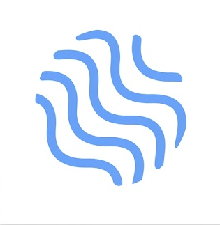

<div align="center">



# QUIPU — Información para la gestión Universitaria

**Aplicación web progresiva (PWA) para la exploración, gestión y visualización de datos  en el ámbito universitario.**

[](https://angular.dev)
[](https://www.typescriptlang.org/)
[](./LICENSE)
[]()
[](https://uncuyoapp.github.io/quipu-2/)
[](./CODE_OF_CONDUCT.md)

[🌐 Demo en vivo](#-demo-en-vivo) · [📖 Sobre QUIPU](#-sobre-quipu) · [🚀 Inicio rápido](#-inicio-rápido) · [📚 Documentación](#-documentación) · [🤝 Contribuciones](./CONTRIBUTING.md)

</div>

---

## 📖 Sobre QUIPU

### ¿Qué es?

**QUIPU** es una plataforma tecnológica que permite visualizar información relevante para la toma de decisiones de una manera sencilla y rápida. Es un desarrollo original del **Área de Políticas Públicas** de la **Universidad Nacional de Cuyo (UNCUYO)**, destinado específicamente al ámbito de gestión universitaria.

El sistema presenta información de manera accesible y concisa, con alta orientación a la buena experiencia del usuario. Cuenta con distintas funcionalidades que permiten explorar los datos de acuerdo a las necesidades de cada usuario: vistas de gráficos con filtros y múltiples opciones de visualización, tablas, fichas técnicas, descargas, reportes, navegación por categorías y diversas herramientas de búsqueda.

Permite la creación de diferentes “unidades de información” que facilitan la administración de organizaciones con estructuras institucionales complejas. Los distintos niveles institucionales pueden compartir y colaborar en la producción de información estratégica y de gestión. 

### Software público y libre como motor de la innovación

Desde el Área de Políticas Públicas promovemos el desarrollo de software público y libre. Creemos que el trabajo colaborativo genera mejores resultados y aumenta la confianza en las instituciones públicas. Nos sumamos a la comunidad global que promueve la construcción de un ecosistema digital más abierto y justo, donde las soluciones tecnológicas sean entendidas como bienes comunes al servicio de la sociedad.

> 🔗 **Más información institucional:** [uncuyo.edu.ar/politicaspublicas/](https://www.uncuyo.edu.ar/politicaspublicas/)

### ¿Por qué existe?

QUIPU busca contribuir a dar respuesta a las dificultades asociadas a:

- La **subutilización** de los sistemas de información universitaria.
- La **fragmentación** de la información en silos organizacionales.
- Los problemas de **integración** del uso de datos en los procesos de planificación, monitoreo y evaluación de la gestión.
- **La dispersión y pérdida** de información fundamental para la toma de decisiones oportuna.

### Objetivos

|     | Objetivo                                                                                    |
| --- | ------------------------------------------------------------------------------------------- |
| 🎯  | Contribuir al fortalecimiento de la planificación y seguimiento de la gestión universitaria |
| 📊  | Integrar datos provenientes de distintas fuentes y transformarlos en información útil       |
| 🔧  | Desarrollar una herramienta para la recolección de datos y sistematización de indicadores relevantes   |
| 📈  | Construir un sistema de visualización amigable orientado a las personas que gestionan diferentes espacios de la universidad     |
| 🏛️  | Utilizar y procesar la información generada por los sistemas de gestión universitaria (SIU) |

### El ecosistema QUIPU

El sistema QUIPU se compone de **dos capas de software** que se comunican entre sí:

```
┌─────────────────────────────────────────────────────────────────┐
│                     ECOSISTEMA QUIPU                            │
│                                                                 │
│  ┌─────────────────────────┐   ┌─────────────────────────────┐  │
│  │       BACKEND           │   │      FRONTEND (este repo)   │  │
│  │                         │   │                             │  │
│  │  • Almacenamiento       │◄──►  • Visualización de datos   │  │
│  │  • Administración       │   │  • Exploración interactiva  │  │
│  │  • Configuración        │   │  • Gráficos y tablas        │  │
│  │  • Gestión de usuarios  │   │  • Búsqueda y filtros       │  │
│  │  • Unidades de Info.    │   │  • Gestión (modo admin)     │  │
│  └─────────────────────────┘   └─────────────────────────────┘  │
│                                                                 │
│  Cada Unidad Académica, Secretaría o Área puede gestionar       │
│  su propia Unidad de Información de forma autónoma.             │
└─────────────────────────────────────────────────────────────────┘
```

- La **capa backend** es la encargada de almacenar, administrar y configurar la información y usuarios. Tiene la capacidad de replicarse para ofrecer una gestión autónoma de datos para cada Unidad Académica, Secretaría, Dirección o Área que lo requiera (denominadas _Unidades de Información_).
- La **capa frontend** (este repositorio) es la encargada de presentar la información de cada Unidad de Información por medio de herramientas que facilitan el acceso y exploración de datos.

> **Este repositorio contiene únicamente el código del frontend.** El backend se gestiona de forma independiente.

---

## 🌐 Demo en línea

Una versión de demostración de QUIPU está disponible en **GitHub Pages** con datos ficticios (_mock data_):

### 👉 [**Acceder a la demo**](https://uncuyoapp.github.io/quipu-2/)

#### Sobre los datos de la demo

> [!IMPORTANT]
> La demo utiliza **datos ficticios** generados exclusivamente para fines demostrativos. **Ningún dato presentado en la demo corresponde a información real** de la Universidad Nacional de Cuyo ni de ninguna otra institución. Los nombres de temáticas, visualizaciones, indicadores y valores numéricos fueron completamente inventados para ilustrar las capacidades del sistema.

La demo funciona de manera **completamente autónoma**, sin conexión a ningún servidor backend. Esto es posible gracias al sistema de proveedores de datos intercambiables de la aplicación (ver [Arquitectura](#arquitectura-técnica)).

#### Credenciales de prueba

| Rol | Usuario | Contraseña | Permisos |
| :--- | :--- | :--- | :--- |
| Administrador General | `admin` | `admin123` | Acceso completo (Multi-unidad) |
| Administrador Unidad | `analista.spf` | `spf2024` | Gestión Unidad SPF |
| Visitante Unidad | `analista.fcs` | `fcs2024` | Solo lectura Unidad FCS |

---

## 🚀 Inicio rápido

### Prerrequisitos

- **Node.js** ≥ 18.x
- **npm** ≥ 9.x
- **Angular CLI** ≥ 18.x (`npm install -g @angular/cli`)

### Instalación

```bash
# 1. Clonar el repositorio
git clone https://github.com/uncuyoapp/quipu-2.git
cd quipu-2

# 2. Instalar dependencias
npm install

# 3. Levantar en modo desarrollo (con datos mock)
npm start
```

La aplicación estará disponible en `http://localhost:4200`.

> **Nota**: en modo desarrollo se usa `MockDataProvider` por defecto. No se requiere ningún backend activo.

### Scripts disponibles

| Script                  | Descripción                                |
| ----------------------- | ------------------------------------------ |
| `npm start`             | Dev server con hot reload (datos mock)     |
| `npm run build`         | Build de producción (conexión a API real)  |
| `npm run build:testing` | Build para QA con datos mock               |
| `npm run serve:testing` | Build + serve local para testing de PWA    |
| `npm run pwa:icons`     | Regenerar íconos PWA desde `logo-base.png` |
| `npm test`              | Ejecutar tests unitarios                   |

---

## 🏗️ Arquitectura técnica

### Stack tecnológico

| Categoría              | Tecnología                                                                                                                                                                                                                                  |
| ---------------------- | ------------------------------------------------------------------------------------------------------------------------------------------------------------------------------------------------------------------------------------------- |
| Framework              | Angular 18+ (Standalone Components)                                                                                                                                                                                                         |
| Lenguaje               | TypeScript 5.x (strict, sin `any`)                                                                                                                                                                                                          |
| Estilos                | SASS/SCSS con design tokens                                                                                                                                                                                                                 |
| UI Components          | Angular Material + CDK                                                                                                                                                                                                                      |
| Visualización de datos | [`@uncuyoapp/ngx-data-visualizer`](https://github.com/uncuyoapp/ngx-data-visualizer) (librería interna, basada en [ECharts](https://echarts.apache.org/) para gráficos y [PivotTable.js](https://pivottable.js.org/) para tablas dinámicas) |
| Reactividad            | Angular Signals (`signal`, `computed`, `effect`)                                                                                                                                                                                            |
| PWA                    | `@angular/service-worker`                                                                                                                                                                                                                   |
| Íconos                 | `@ng-icons/ionicons`                                                                                                                                                                                                                        |

### Patrón arquitectónico: CQRS-lite

La aplicación implementa un patrón **CQRS-lite** (Command-Query Responsibility Segregation simplificado) que separa estrictamente la lectura de estado de la escritura de datos en capas de servicios distintas:

```
  Capa 0 — Infraestructura     Fachadas de acceso a datos (Read / Write)
  Capa 1 — Estado               Signal stores globales (solo lectura)
  Capa 2 — Persistencia         Mutaciones CRUD + sincronización de estado
  Capa 3 — Edición / UX         Orquestación de diálogos y validaciones
```

### Proveedor de datos intercambiable

La aplicación es **agnóstica de la fuente de datos** gracias al patrón Strategy:

- **`QuipuApiProvider`**: Conecta con el backend real via HTTP.
- **`MockDataProvider`**: Lee datos estáticos locales para desarrollo y demo (el que usa GitHub Pages).

La selección es automática según el entorno de compilación, sin cambiar una línea de código en los componentes.

### Estructura del proyecto

```
src/app/
├── core/           # Servicios, modelos, infraestructura, guards, config
├── pages/          # Páginas principales (Home, Thematic, Visualization…)
├── components/     # Componentes reutilizables por feature
├── layout/         # Shell, NavBar, EditModeBar, Breadcrumb, Footer
└── shared/         # Componentes UI genéricos (Button, Tag, AlertBadge…)
```

Para una descripción completa, consultar [ARCHITECTURE.md](./ARCHITECTURE.md).

---

## 📚 Documentación

| Documento                                        | Descripción                                                             |
| ------------------------------------------------ | ----------------------------------------------------------------------- |
| [ARCHITECTURE.md](./ARCHITECTURE.md)             | Arquitectura CQRS-lite, capas de servicios, patrones y convenciones     |
| [CONTRIBUTING.md](./CONTRIBUTING.md)             | Guía de contribución, Gitflow, convenciones de commits y proceso de PR  |
| [RELEASING.md](./RELEASING.md)                   | Ciclo SemVer, automatización de versiones, build y deploy               |
| [STYLE_GUIDE.md](./STYLE_GUIDE.md)               | Sistema de design tokens, tipografía, colores y convenciones de estilos |
| [EVENT_CATALOG.md](./EVENT_CATALOG.md)           | Catálogo de eventos y señales de la aplicación                          |
| [CODE_OF_CONDUCT.md](./CODE_OF_CONDUCT.md)       | Código de conducta para la comunidad                                    |
| [SECURITY.md](./SECURITY.md)                     | Política de reporte de vulnerabilidades                                 |

---

## 🤝 Contribuciones

QUIPU es un proyecto open-source y acepta contribuciones de la comunidad. Antes de abrir un PR, por favor leer la [guía de contribución](./CONTRIBUTING.md), que cubre:

- Configuración del entorno de desarrollo
- Estrategia de ramas (Gitflow)
- Convenciones de commits (Conventional Commits)
- Estándares de código (TypeScript estricto, Angular Signals, CQRS)
- Proceso de revisión y aprobación de PRs

### Reglas fundamentales para contribuidores

| Regla               | Descripción                                               |
| ------------------- | --------------------------------------------------------- |
| ❌ Sin `any`        | Tipado estricto en todo el código TypeScript              |
| ✅ `inject()`       | Única forma de inyectar dependencias                      |
| ✅ Standalone       | No crear `NgModule`, todos los componentes son standalone |
| ✅ `@if` / `@for`   | Sintaxis nativa de control de flujo (no `*ngIf`)          |
| ✅ JSDoc en español | Documentar todo componente, servicio y método público     |
| ✅ `.model.ts`      | Sufijo obligatorio para modelos (ver [CONTRIBUTING.md](./CONTRIBUTING.md)) |

---

## 📄 Licencia

Este proyecto está distribuido bajo la **GNU General Public License v3.0 (GPL-3.0)**.

Esto significa que podés usar, estudiar, modificar y distribuir este software libremente, siempre y cuando cualquier obra derivada se distribuya bajo la misma licencia.

Ver [LICENSE](./LICENSE) para el texto completo.

---

## 🏛️ Créditos

<div align="center">

Desarrollado con ❤️ por el **Área de Políticas Públicas**
**Universidad Nacional de Cuyo (UNCUYO)**
Mendoza, Argentina

[🌐 Sitio institucional](https://www.uncuyo.edu.ar/politicaspublicas/) · [📧 Contacto](https://www.uncuyo.edu.ar/politicaspublicas/informacion-contacto) · [🔗 QUIPU en producción](https://quipu.uncu.edu.ar/)

</div>
